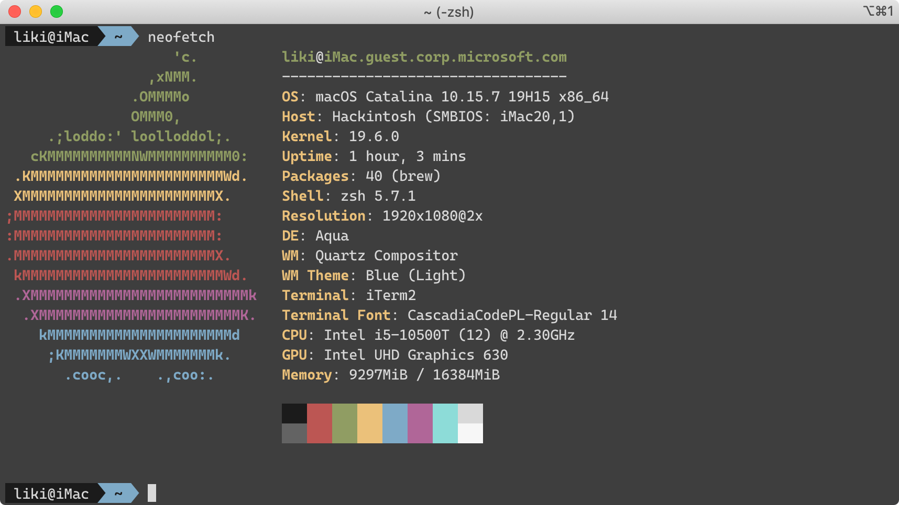

# OpenCore on Dell OptiPlex 7080 MFF

OpenCore for macOS Big Sur (11.4) on Dell OptiPlex 7080 MFF

## Tutorials

-   [折腾 7080MFF 黑苹果 OpenCore](https://www.jianshu.com/p/d7cfaae60509)
-   [3dudu/dell-optiplex-7080-hackintosh-opencore](https://github.com/3dudu/dell-optiplex-7080-hackintosh-opencore)

## Usage

Use `Install/EFI` for installataion and `Run/EFI` for daily use.

## Hardware

-   CPU: Intel Comet Lake i5 10500T
-   Chipset: Intel Q470
-   Memory: 8G DDR4 2666 \* 2
-   iGPU: UHD 630
-   SSD: Lenovo SL700 PCI-E M.2 256G
-   Sound: ALC256
-   Ethernet: Intel I219-LM7
-   Wireless / BT: Replaced AX201 with [BCM94352Z M.2](https://dortania.github.io/Wireless-Buyers-Guide/types-of-wireless-card/m2.html)

## Status

### Working (with BCM94352Z)

-   HWP
-   Sleep
-   iGPU with HiDPI
-   Ethernet
-   WiFi
-   Bluetooth
-   Sound

### Partially working (with AX201)

If uses AX201, the driver currently is not perfect:

-   Wireless, requires Heliport
-   BT, not yet working with BT4.0 devices

## Gotchas

-   Mostly followed [折腾 7080MFF 黑苹果 OpenCore](https://www.jianshu.com/p/d7cfaae60509) to prepare the EFI for both installation and daily running environment.
-   The `SSDT-RHUB.aml` needs to be removed if you manually mapped your USB ports with [Hackintool](https://github.com/headkaze/Hackintool) by using the `USBPorts.kext`.
-   Modify BIOS to disable CFG Lock and enable DVMT. Use `Ctrl+W` to save the change. And the DVMT is within the **SaSetup**, which is different from CFG Lock which locates within **CpuSetup**.
-   The `AirportItlwm.kext` will cause kernel panic now.

### Upgrading

-   You might encounter `IPI Time` kernel panic during upgrading to newer version of macOS. I suspect it was still due to the sleeping tweak is not fully working. The mitigation right now is use the USB stick to boot up with the Installation EFI successfully. Then remove the USB stick and reboot again normally into the system.

## Updates

-   **6/15**: Update to OpenCore 0.7.0. Tested on Big Sur 11.4.
-   **3/8**: Update to OpenCore 0.6.7. Tested on Big Sur 11.2.2. Also replaced the `USBPort.kext` with `USBMap.kext` for correct [USB mapping](https://dortania.github.io/OpenCore-Post-Install/usb/intel-mapping/intel.html).
-   **1/22**: Upgrade to Big Sur 11.2 RC smoothly.
-   **1/8**: Update to OpenCore 0.6.5. Tested on Big Sur 11.2 beta.
-   **12/14**: Fixed restart issue, thanks 3dudu for this [great tip](http://bbs.pcbeta.com/forum.php?mod=viewthread&tid=1876879) on patching the ACPI.
-   **12/3**: Updated OpenCore with latest nightly build (0.6.4)
