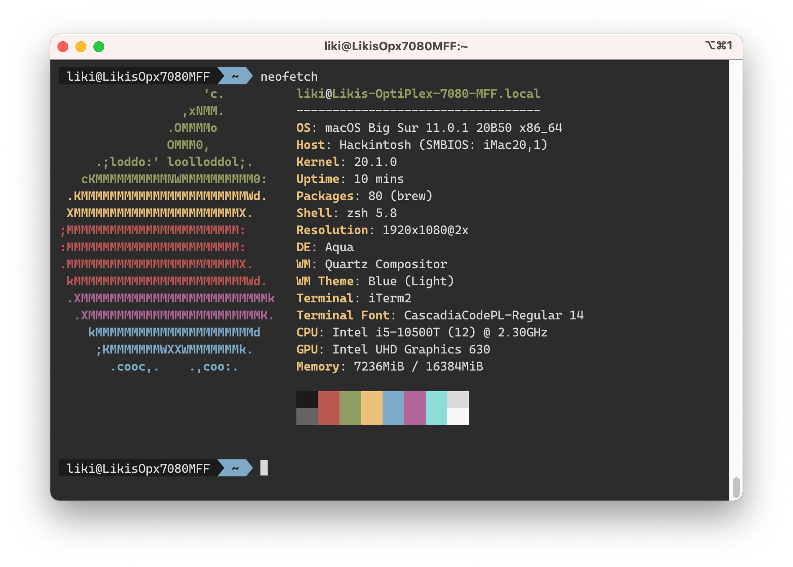

# OpenCore on Dell OptiPlex 7080 MFF

*Update: 11/30*

OpenCore for macOS Catalina (10.15.7) on Dell OptiPlex 7080 MFF

## Tutorials

* [折腾 7080MFF 黑苹果 OpenCore](https://www.jianshu.com/p/d7cfaae60509)
* [3dudu/dell-optiplex-7080-hackintosh-opencore](https://github.com/3dudu/dell-optiplex-7080-hackintosh-opencore)

## Hardware

* CPU: Intel Comet Lake i5 10500T
* Chipset: Intel Q470
* Memory: 8G DDR4 2666 * 2
* iGPU: UHD 630
* SSD: Lenovo SL700 PCI-E M.2 256G
* Sound: ALC256
* Ethernet: Intel I219-LM7
* Wireless / BT: Replaced AX201 with [BCM94352Z M.2](https://dortania.github.io/Wireless-Buyers-Guide/types-of-wireless-card/m2.html)

## Status

### Working (with BCM94352Z)

* HWP
* Sleep
* iGPU with HiDPI
* Ethernet
* WiFi
* Bluetooth
* Sound

### Partially working (with AX201)

If uses AX201, the driver currently is not perfect:

* Wireless, requires Heliport
* BT, not yet working with BT4.0 devices

### Not working

* Reboot and shutdown correctly

## Gotchas

* Mostly followed [折腾 7080MFF 黑苹果 OpenCore](https://www.jianshu.com/p/d7cfaae60509) to prepare the EFI for both installation and daily running environment.
* The `SSDT-RHUB.aml` needs to be removed if you manually mapped your USB ports with [Hackintool](https://github.com/headkaze/Hackintool) by using the `USBPorts.kext`.
* Modify BIOS to disable CFG Lock and enable DVMT. Use `Ctrl+W` to save the change. And the DVMT is within the **SaSetup**, which is different from CFG Lock which locates within **CpuSetup**.
* The `AirportItlwm.kext` will cause kernel panic now.

